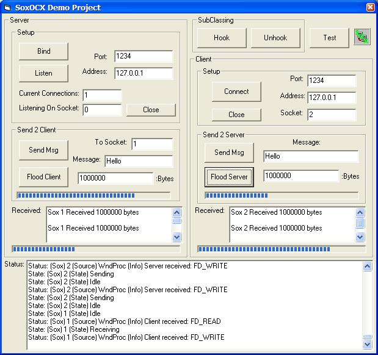



## API \- The Ultimate WinSock OCX replication to WinSock API commands

### Description

Sox is a 'best of breed' project incorporating a month of intense study and testing! With the ability to adjust ALL WinSock API features, eg. KeepAlives, TCP_NODELAY or the Send and Receive buffer sizes, you have the full power and flexability of the API at your disposal! This project utilizes the fastest methods in every aspect, from the Data Buffers to the Sockets Array and is guaranteed to outperform any other project of this nature! If its heavy duty with high traffic, then Sox is your VB answer! Read my Readme.rtf for Conventions, Credits and OCX Differences! Mail me and vote please :)
 
### More Info
 

             |
---                |---
**Submitted On**   |2002-05-29 17:34:06
**By**             |[Trevor Herselman](https://github.com/Planet-Source-Code/PSCIndex/blob/master/ByAuthor/trevor-herselman.md)
**Level**          |Intermediate
**User Rating**    |4.9 (78 globes from 16 users)
**Compatibility**  |VB 6\.0
**Category**       |[Windows API Call/ Explanation](https://github.com/Planet-Source-Code/PSCIndex/blob/master/ByCategory/windows-api-call-explanation__1-39.md)
**World**          |[Visual Basic](https://github.com/Planet-Source-Code/PSCIndex/blob/master/ByWorld/visual-basic.md)
**Archive File**   |[API\_\-\_The\_880855292002\.zip](https://github.com/Planet-Source-Code/trevor-herselman-api-the-ultimate-winsock-ocx-replication-to-winsock-api-commands__1-35239/archive/master.zip)

